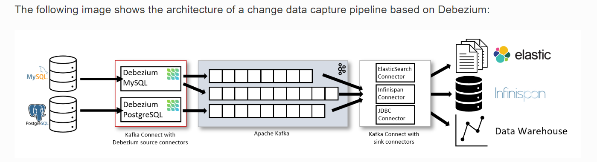
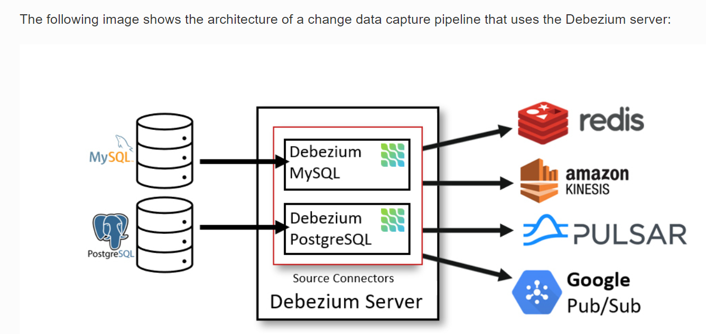

# Streaming Database Changes
### Change Data Capture

      Change data capture (CDC) refers to the tracking of all changes in a data source (databases, data warehouses, etc.)
          so they can be captured in destination systems. In short, CDC allows organizations to achieve data 
      integrity and consistency across all systems and deployment environments. 

      Additionally, it allows organizations to use the right tool for the right job by moving data from legacy databases to 
      purpose-built data platforms, such as document or search databases and data warehouses.

      wikipedia 

      In databases, change data capture (CDC) is a set of software design patterns used to determine and track the data that 
      has changed (the "deltas") so that action can be taken using the changed data. The result is a delta-driven dataset.

### Use Cases
##### Data Replication
* Replica data to other DB
* Feed analytic system or DWH
* Feed data to other teams
##### Microservice Architecture
* Propagate data between different services without coupling
* Each services keeps optimised views locally.
##### Others
* Update or invalidate caches
* Enable full-text search via Elasticsearch, Solr etc.
* Update CDRS models.
### Possible approaches
#### Dual Writes
* Failure Handling ? 
* Prone to race condition  
([https://www.confluent.io/blog/using-logs-to-build-a-solid-data-infrastructure-or-why-dual-writes-are-a-bad-idea/#:~:text=As%20we%20saw%2C%20dual%20writes,race%20conditions%20and%20partial%20failures.](https://www.confluent.io/blog/using-logs-to-build-a-solid-data-infrastructure-or-why-dual-writes-are-a-bad-idea/#:~:text=As%20we%20saw%2C%20dual%20writes,race%20conditions%20and%20partial%20failures.))
#### Polling for changes
* How to find changes rows ?
* How to handle deleted rows
### Methodology
* Timestamps on rows
* Version numbers on rows
* Status indicators on rows
* Time/version/status on rows
* Triggers on tables
* Event programming
* Log scanners
### Monitoring the DB
* Reading the database log
* Failure only cause delays but no inconsistencies
* Transparent to upstream application
### Database Logs
* Apps write to the DB
* DB records changes in log files, then update tables
* Logs used for TX recovery, replication etc.
  * MySql: BinLog
  * Postgres: write-ahead log
  * MongoDB op log
  * SQL Server: write-ahead log. 
## Let's use that for CDC
#### Available tools in the market
* Keboola.
* Oracle GoldenGate.
* Qlik Replicate.
* IBM InfoSphere Change Data Capture.
* Fivetran (Former HVR)
* Hevo Data.
* Talend.
* Debezium. 
[https://rivery.io/data-learning-center/best-change-data-capture-tools/](https://rivery.io/data-learning-center/best-change-data-capture-tools/) 
[https://hevodata.com/learn/7-best-cdc-tools/)](https://hevodata.com/learn/7-best-cdc-tools/) 
[https://debezium.io/community/users/](https://debezium.io/community/users/)
## Debezium 
##### (open source under the Apache License, Version 2.0.)

    Debezium is an open source distributed platform that turns your existing databases 
    into event streams, so applications can see and respond almost instantly to each 
    committed row-level change in the databases. 
    Debezium is built on top of Kafka and provides Kafka Connect compatible connectors that 
    monitor specific database management systems. 
    Debezium records the history of data changes in Kafka logs, so your application 
    can be stopped and restarted at any time and can easily consume all of the events it 
    missed while it was not running, ensuring that all events are processed correctly and completely. 

    Embedded Engine

    An alternative way for using the Debezium connectors is the embedded engine.
    In this case, Debezium won’t be run via Kafka Connect, but as a library embedded
    into your custom Java applications. This can be useful for either consuming change
    events within your application itself, without the needed for deploying complete
    Kafka and Kafka Connect clusters, or for streaming changes to alternative messaging
    brokers such as Amazon Kinesis.

### Features  [https://debezium.io/documentation/reference/stable/features.html](https://debezium.io/documentation/reference/stable/features.html)
* Data monitoring even when apps are down
* Supports MySQL servers, PostgreSQL servers, SQL servers, and MongoDB
* Minimal data loss
### Benefits of CDC with Debezium
* The Source of truth data is maintained in the application’s database tables and transaction log
* It offers reliable messaging and transactional guarantees and this minimizes any possibility of data corruption or loss
* It’s a more flexible solution
* It is easier to maintain due to its simple design
* It allows you to read and query your own writes
* It is strongly consistent within the application’s database and eventually consistent across the entire the system
### Drawbacks of CDC with Debezium
* This approach can add extra latency to the database when reading the transaction log or when polling the message broker
### Architecture   [https://debezium.io/documentation/reference/stable/architecture.html](https://debezium.io/documentation/reference/stable/architecture.html)

### How it works
###### it's very from database to database
#### SQL Server  [https://debezium.io/documentation/reference/stable/connectors/sqlserver.html](https://debezium.io/documentation/reference/stable/connectors/sqlserver.html)

    SQL Server CDC is not designed to store a complete history of database changes. 
    For the Debezium SQL Server connector to establish a baseline for the current state of the database, 
    it uses a process called snapshotting. The initial snapshot captures the structure and data of the 
    tables in the database.

    After the snapshot process begins, if the process is interrupted due to connector failure, rebalancing, 
    or other reasons, the process restarts after the connector restarts.

    After the connector completes the initial snapshot, it continues streaming from the position that it read 
    in (Read the maximum log sequence number (LSN) position in the server’s transaction log.) so that it does not 
    miss any updates.

#### Postgres [https://debezium.io/documentation/reference/stable/connectors/postgresql.html](https://debezium.io/documentation/reference/stable/connectors/postgresql.html)

### Performance
[https://debezium.io/blog/2023/06/29/debezium-oracle-series-part-3/](https://debezium.io/blog/2023/06/29/debezium-oracle-series-part-3/) 
[https://reorchestrate.com/posts/debezium-performance-impact/#:~:text=Given%20that%20Debezium%20reuses%20the,performance%20impact%20by%20enabling%20Debezium.](
https://reorchestrate.com/posts/debezium-performance-impact/#:~:text=Given%20that%20Debezium%20reuses%20the,performance%20impact%20by%20enabling%20Debezium.)
<i>Reference </i>[https://debezium.io/documentation/reference/](https://debezium.io/documentation/reference/) 
<i>Examples </i>[https://github.com/debezium/debezium-examples](https://github.com/debezium/debezium-examples) 
<i>Credit Gunnar Morling</i> [https://www.youtube.com/watch?v=IOZ2Um6e430&t=2152s](https://www.youtube.com/watch?v=IOZ2Um6e430&t=2152s) 

    Push versus pull
    Push: the source process creates a snapshot of changes within its own process and delivers rows downstream. The downstream process uses the snapshot, creates its own subset and delivers them to the next process.
    Pull: the target that is immediately downstream from the source, prepares a request for data from the source. The downstream target delivers the snapshot to the next target, as in the push model.

